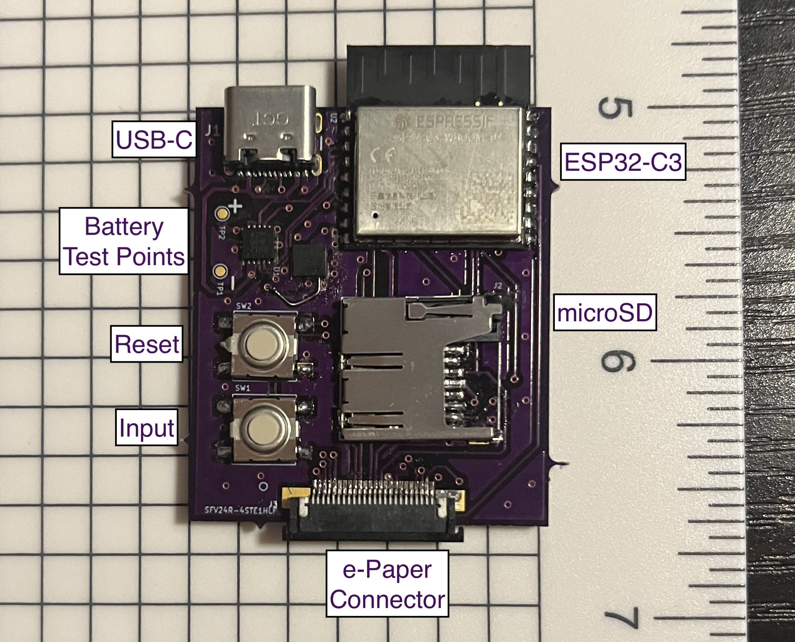

# Hardware / Device Information

The assembled circuit board looks as below:

The other side of the board primarily has passives on it.

For reference, the output schematics, fabrication files (gerbers), and BOM from the initial schematics
are provided in the `hardware/v1` folder of the repository.

With the new design, the project files will be better structured to be repository-friendly,
and KiCad project files will be added as well.

# Quirks

There are a litany of small and large changes that will be fixed with a new design (most of these being from the
prototype-like nature of v1):

* The pinout of the connector and display are in opposite order from intended, so the board folds in the
  wrong/unintended direction in an enclosure. Oops!
* The LDO symbol and layout could be adjusted for an enable version.
* The power/charging/LDO circuitry can probably be re-done to have lower quiescent power draw and
  be easier to hand-solder.
* Proper battery terminals should be added. On v1 the battery connection is done to test points.
* It would be nice to have some sort of mounting holes on the board.
* One footprint (C1) is too small (0603 when 0805 was intended).
* Footprints in general can probably be adjusted for easier hand soldering.
* It would be nice to also support the larger display connector and parallel interfaces,
  since larger displays drop support for 1-wire SPI.
* The SD card holder can be moved to be more flush to the edge of the board.
* More buttons would be nice. In particular, an additional button on the ESP32-C3 strapping pin
  to force USB flashing mode would be helpful for recovery.
* An off switch might be helpful.